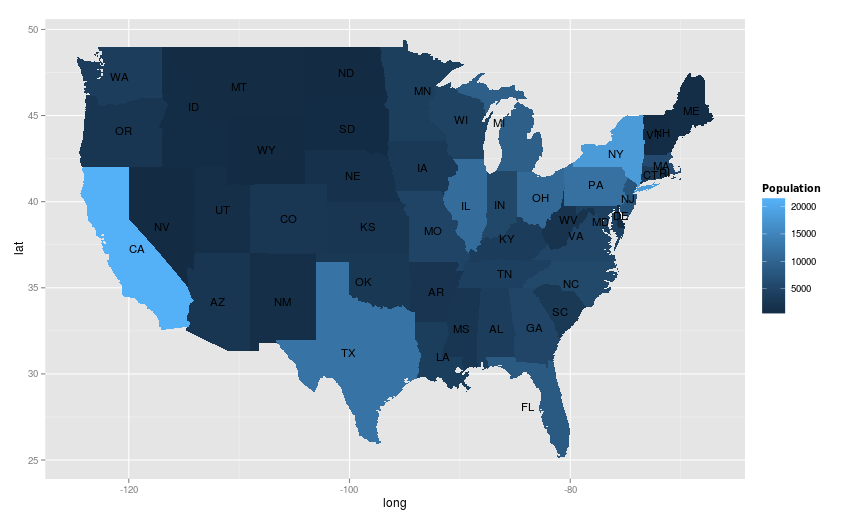
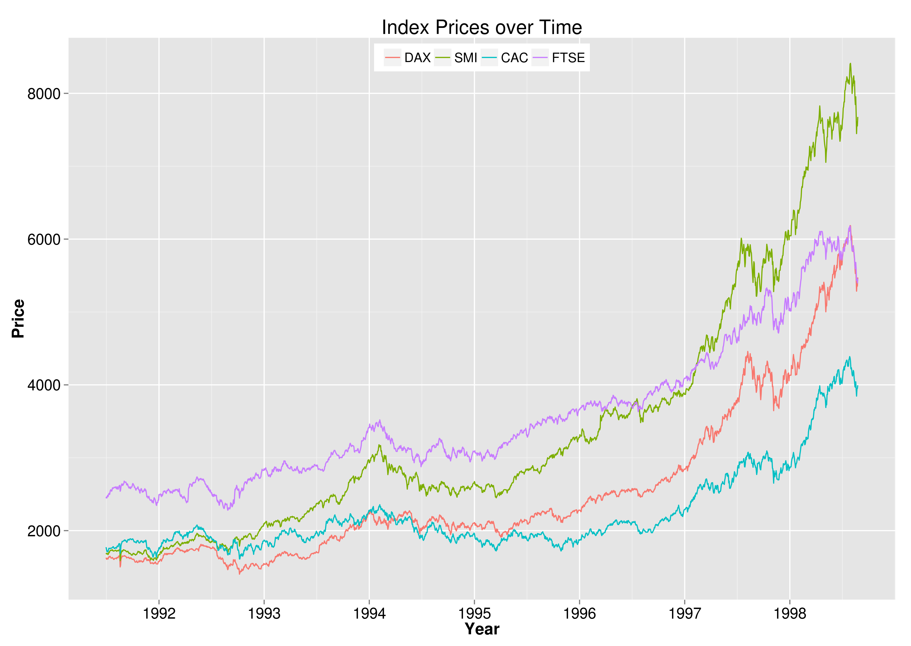
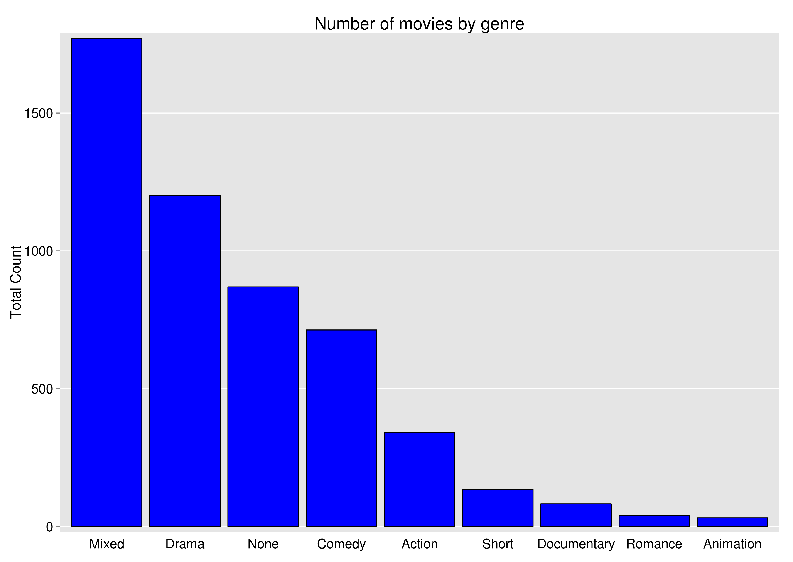
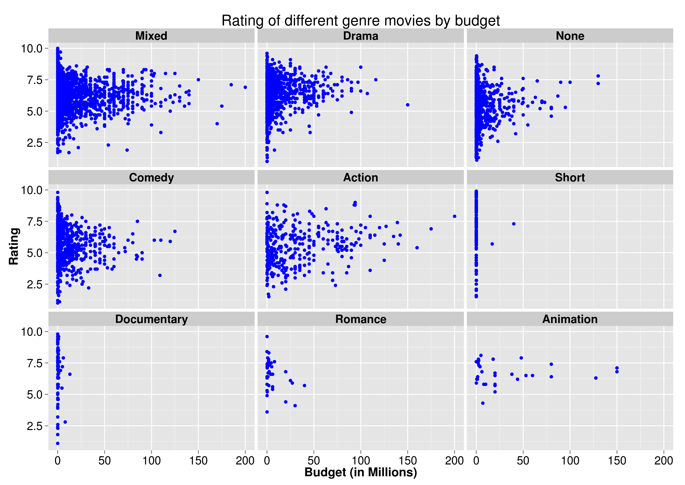

Data Visualization
===================
I made a shiny app with R showing overview of the U.S States. I am currently working on this application, therefore, it might have few bugs.

Here is the link 
https://deekshachugh.shinyapps.io/homework3/

Here are some static plots that I made in R:

==============================

==============================

==============================

==============================

